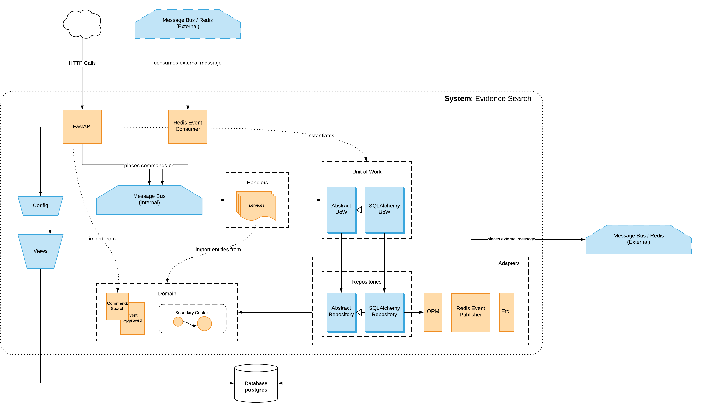

# Architectural Patterns

## Reasoning

The fundamental reasoning and criteria for devising this architectural design was to answer: "**How can we best structure the application as to have independent, decoupled and easily testable and maintanble abstractions?"

### Functional Core Imperative Shell

This is a work that is inspired mainly from the ideas of [Functional Core Imperative Shell](https://www.destroyallsoftware.com/screencasts/catalog/functional-core-imperative-shell), from hexagonal architecture's [Ports and Adapters](https://matthiasnoback.nl/2017/08/layers-ports-and-adapters-part-3-ports-and-adapters/)) and from [Dependency Inversion principles](https://en.wikipedia.org/wiki/Dependency_inversion_principle). The goal is to achieve:

1. A pure and isolated domain layer that implements business rules; fully covered in unit tests that are easy to write, run and maintain
2. Map this isolated domain layer to a persistent store
3. Minimize the amount of integration and e2e tests
4. Decouple and easily abstracts integrations of 3rd parties (to adhere to sane SRP)
5. Decouple service handlers in a event-driven —which enables us to migrate to a serverless infrastructure

### Abstractions

#### Domain: `domain`

1. **Imutability**: `Value Object`
Object that is defined by its attributes. Which *never* mutate.
2. **Identifiability**: `Entity`
Object whose attributes *change over time*. Has an identity.
3. **Register**: `Event`
Represents something that has happened within the system.
4. **Actions**: `Command`
Represents some work and command that the system must perform.
5. **Consistency and invariants**: `Aggregate`
Object that semantically abstracts a business macro-entity. It is composed of Value Objects and Entities. It is domain's entrypoint and where public domain services lives. It enables that we consider an aggregate as a whole, a single unity and, hence, preserve expected consistency inside those boundaries. Each operation within this bounded context ends in a *consitent and expected state*.

#### Adapters: `adapters`

Implements interfaces between the system and external world (I/O)

1. **Persistent storage**: `Repository`
Couples with an aggregate to enable persistent storage. This adapter may implement a SQL, an S3, a DynamoDB or any other client connection.
2. **Publishing**: `Event Publisher`
Publishes events in external message buses.

#### Services: `services`

Orchestrates domain and adapter's workflows that are mapped to user stories.

1. **Atomic operations**: `Unit of Work`
Enables decoupling of service and data layer. A unit of work acts as a single entrypoint to persitent storage. It holds, for each atomic operation, aggregate state.
2. **Communication**: `Message Bus` (*barramento de mensagens*)
Maps commands and events to handlers. Enables decoupling within service layer through a chain of handlers.
3. **Orchestration**: `Handler`
Workflow that must happen as a response to commands and events.


## Virtual environment

It is advisable to run this project under a specific environment running Python 3.7+

## Dependencies

`poetry` is being used to manage dependencies efficiently. Therefore, it's as simple as

```bash
$ poetry install
```

## Migrations

In order to update database to recent changes on declared metadata, we're using `alembic`. By doing

```bash
alembic upgrade head
```

You should be able to reach most-recent state


## Tests

TDD is being employed so in order to run and test implementations, abstracted to `Makefile`:

```bash
$ make test
```


## Diagram




#### References

This is a self-study of the book Cosmic Python: Architectural Patterns.
